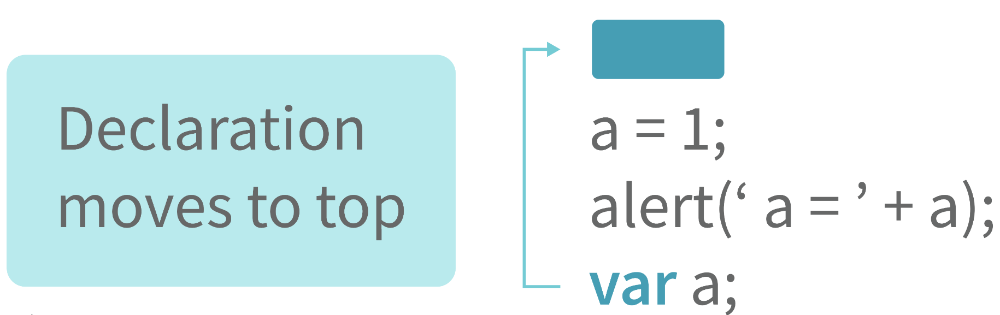
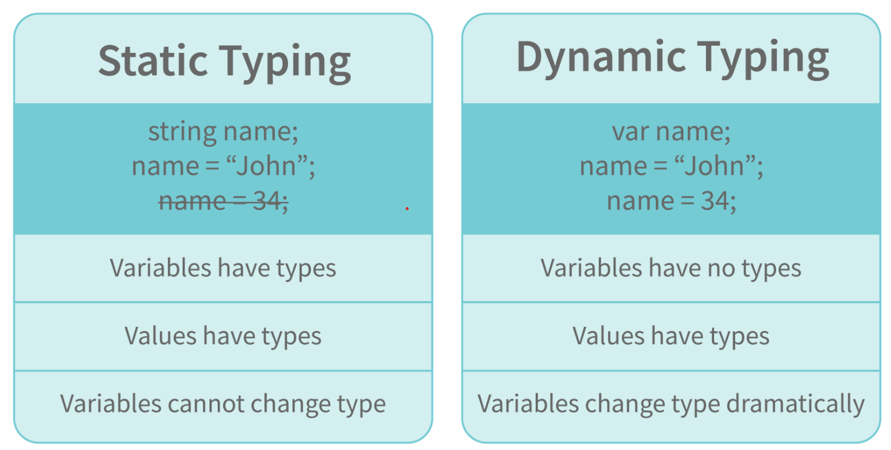
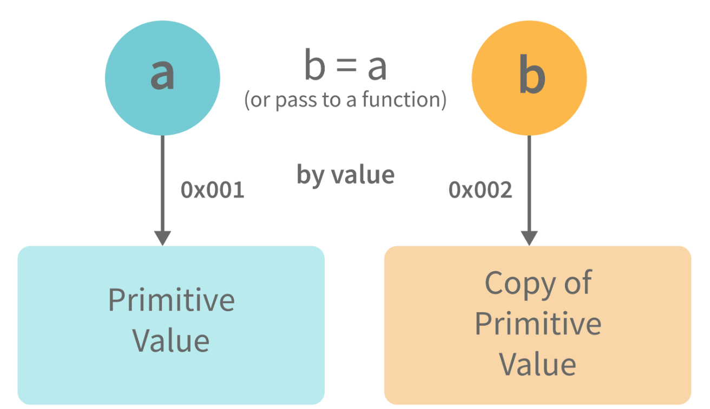
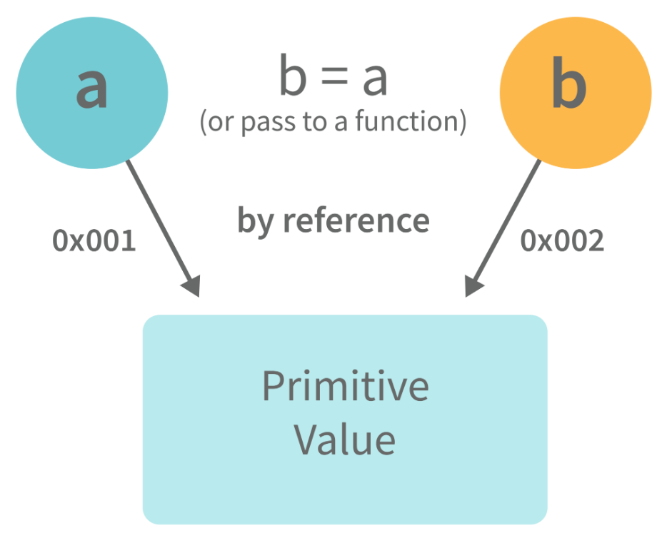
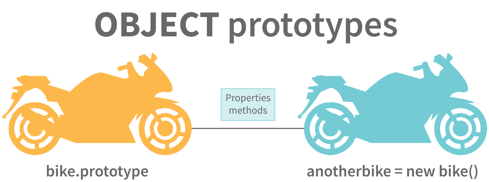
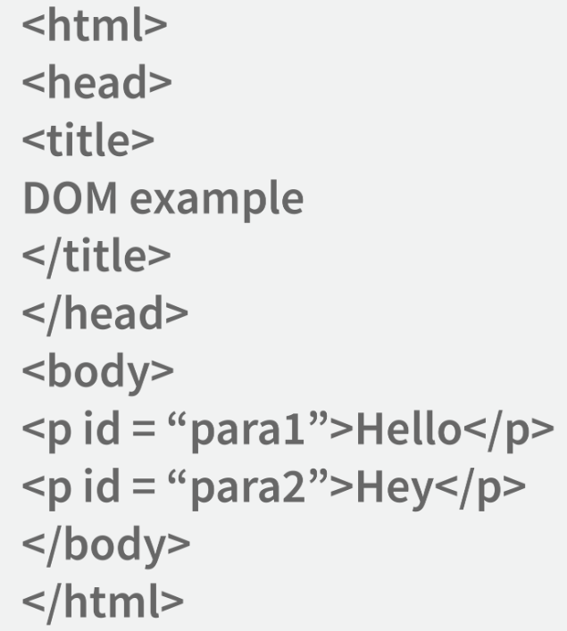
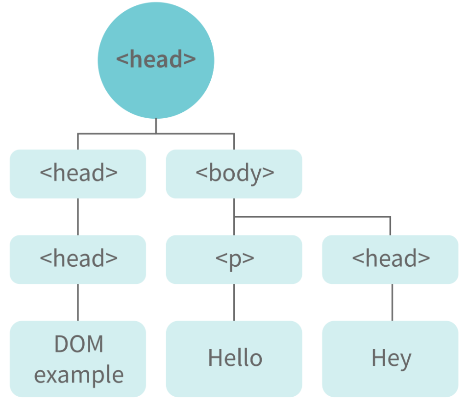
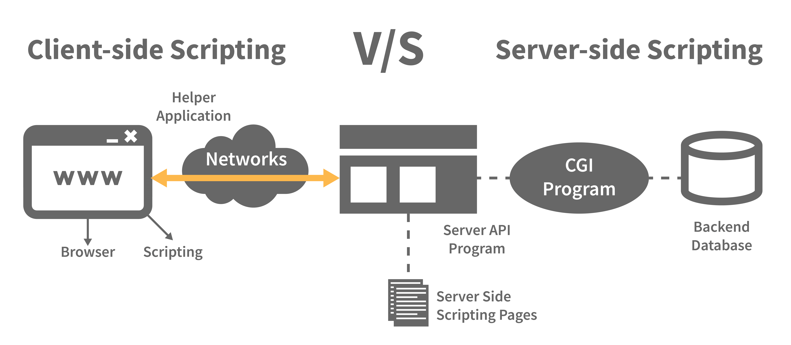
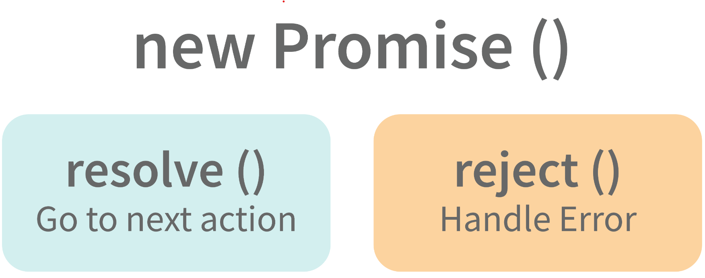

# JavaScript BASICS...

## BEGINNER

### ```1. What are the different data types present in javascript?```
To know the type of a JavaScript variable, we can use the typeof operator.

#### Primitive types:

* String - It represents a series of characters and is written with quotes. A string can be represented using a single or a double quote.
##### Example:

```JavaScript
var str = "Abraham Lincoln"; // using double quotes
var str2 = 'Hideo Kojima'; // using single quotes
console.log(str);
console.log(str2);
```

* Number - It represents a number and can be written with or without decimals.
##### Example:

```JavaScript
var x = 3; // without decimal
var y = 3.6; // with decimal
console.log(x);
console.log(y);
```

* BigInt - This data type is used to store numbers which are above the limitation of the Number data type. It can store large integers and is represented by adding “n” to an integer literal.
##### Example:

```JavaScript
var bigInteger =  234567890123456789012345678901234567890;
console.log(bigInteger);
```

* Boolean - It represents a logical entity and can have only two values : true or false. Booleans are generally used for conditional testing.
##### Example:

```JavaScript
var a = 2;
var b = 3;
var c = 2;
console.log(a == b); // returns false
console.log(a == c); // returns true
```

* Undefined - When a variable is declared but not assigned, it has the value of undefined and it’s type is also undefined.
##### Example:

```JavaScript
var x; // value of x is undefined
var y = undefined; // we can also set the value of a variable as undefined
console.log(x);
console.log(y);
```

* Null - It represents a non-existent or a invalid value.
##### Example:

```JavaScript
var z = null;
console.log(z);
```

* Symbol - It is a new data type introduced in the ES6 version of javascript. It is used to store an anonymous and unique value.
##### Example:

```JavaScript
var symbol1 = Symbol('symbol');
console.log(symbol1);
```

* typeof of primitive types:
```JavaScript
console.log(typeof "John Doe"); // Returns "string"
console.log(typeof 3.14); // Returns "number"
console.log(typeof true); // Returns "boolean"
console.log(typeof 234567890123456789012345678901234567890n); // Returns bigint
console.log(typeof undefined); // Returns "undefined"
console.log(typeof null); // Returns "object" (kind of a bug in JavaScript)
console.log(typeof Symbol('symbol')); // Returns Symbol
```

#### Non-primitive types:

* Primitive data types can store only a single value. To store multiple and complex values, non-primitive data types are used.
* Object - Used to store collection of data.
##### Example:

```JavaScript
// Collection of data in key-value pairs

var obj1 = {
   x:  43,
   y:  "Hello world!",
   z: function(){
      return this.x;
   }
}
console.log(obj1);
      
// Collection of data as an ordered list
     
var array1 = [5, "Hello", true, 4.1];
console.log(array1);
```

``` Note- It is important to remember that any data type that is not a primitive data type, is of Object type in javascript.```

### ```2. Explain Hoisting in javascript.```

#### Hoisting is the default behaviour of javascript where all the variable and function declarations are moved on top.

<div align="center">

</div>

This means that irrespective of where the variables and functions are declared, they are moved on top of the scope. The scope can be both local and global.

##### Example 1:

```JavaScript
hoistedVariable = 3;
console.log(hoistedVariable); // outputs 3 even when the variable is declared after it is initialized	
var hoistedVariable;
```

##### Example 2:

```JavaScript
hoistedFunction();  // Outputs "Hello world!" even when the function is declared after calling

function hoistedFunction(){ 
  console.log(" Hello world! ");
} 
```

##### Example 3:

```JavaScript
// Hoisting takes place in the local scope as well
function doSomething(){
  x = 33;
  console.log(x);
  var x;
} 
doSomething(); // Outputs 33 since the local variable "x" is hoisted inside the local scope
```

``` Note - Variable initializations are not hoisted, only variable declarations are hoisted:```
```JavaScript
var x;
console.log(x); // Outputs "undefined" since the initialization of "x" is not hoisted
x = 23;
```
``` Note - To avoid hoisting, you can run javascript in strict mode by using “use strict” on top of the code:```
```JavaScript
"use strict";
x = 23; // Gives an error since 'x' is not declared
var x;
```

### ```3. Why do we use the word “debugger” in javascript?```

#### The debugger for the browser must be activated in order to debug the code. Built-in debuggers may be switched on and off, requiring the user to report faults. The remaining section of the code should stop execution before moving on to the next line while debugging.

### ```4. Difference between " == " and " === " operators.```

#### Both are comparison operators. The difference between both the operators is that " == " is used to compare values whereas, " === " is used to compare both values and types.

##### Example:

```JavaScript
var x = 2;
var y = "2";
console.log(x == y);  // Returns true since the value of both x and y is the same
console.log(x === y); // Returns false since the typeof x is "number" and typeof y is "string"
```

### ```5. Difference between var and let keyword in javascript.```

#### Some differences are:
* #### From the very beginning, the 'var' keyword was used in JavaScript programming whereas the keyword 'let' was just added in 2015.
* #### The keyword 'Var' has a function scope. Anywhere in the function, the variable specified using var is accessible but in ‘let’ the scope of a variable declared with the 'let' keyword is limited to the block in which it is declared. Let's start with a Block Scope.
* #### In ECMAScript 2015, let and const are hoisted but not initialized. Referencing the variable in the block before the variable declaration results in a ReferenceError because the variable is in a "temporal dead zone" from the start of the block until the declaration is processed.

### ```6. Explain Implicit Type Coercion in javascript.```

#### Implicit type coercion in javascript is the automatic conversion of value from one data type to another. It takes place when the operands of an expression are of different data types.

* String coercion - String coercion takes place while using the ' + ' operator. When a number is added to a string, the number type is always converted to the string type.

##### Example 1:

```JavaScript
var x = 3;
var y = "3";
console.log(x + y); // Returns "33" 
```

##### Example 2:

```JavaScript
var x = 24;
var y = "Hello";
console.log(x + y); // Returns "24Hello"; 
```
```Note - ‘ + ‘ operator when used to add two numbers, outputs a number. The same ' + ' operator when used to add two strings, outputs the concatenated string:```
```JavaScript
var name = "Abhinav";
var surname = " Anand";
console.log(name + surname); // Returns "Abhinav Anand"
```

Let’s understand both the examples where we have added a number to a string,

When JavaScript sees that the operands of the expression x + y are of different types ( one being a number type and the other being a string type ), it converts the number type to the string type and then performs the operation. Since after conversion, both the variables are of string type, the " + " operator outputs the concatenated string "33" in the first example and "24Hello" in the second example.

```Note - Type coercion also takes place when using the ' - ' operator, but the difference while using ' - ' operator is that, a string is converted to a number and then subtraction takes place.```
```JavaScript
var x = 3;
var y = "3";
console.log(x - y); // Returns 0 since the variable y (string type) is converted to a number type
```

* Boolean Coercion - Boolean coercion takes place when using logical operators, ternary operators, if statements, and loop checks. To understand boolean coercion in if statements and operators, we need to understand truthy and falsy values.

Truthy values are those which will be converted (coerced) to true. Falsy values are those which will be converted to false.

All values except false, 0, 0n, -0, " ", null, undefined, and NaN are truthy values.

#### If statements:

##### Example:

```JavaScript
var x = 0;
var y = 23;
        
if(x) { console.log(x) }   // The code inside this block will not run since the value of x is 0 (Falsy)  
        
if(y) { console.log(y) }    // The code inside this block will run since the value of y is 23 (Truthy)
```

#### Logical operators: Logical operators in javascript, unlike operators in other programming languages, do not return true or false. They always return one of the operands.

```OR``` ( | | ) operator - If the first value is truthy, then the first value is returned. Otherwise, always the second value gets returned.

```AND``` ( && ) operator - If both the values are truthy, always the second value is returned. If the first value is falsy then the first value is returned or if the second value is falsy then the second value is returned.

##### Example:
```JavaScript
var x = 220;
var y = "Hello";
var z = undefined;
        
console.log(x || y);    // Returns 220 since the first value is truthy
        
console.log(x || z);  // Returns 220 since the first value is truthy
        
console.log(x && y);    // Returns "Hello" since both the values are truthy
        
console.log(y && z);   // Returns undefined since the second value is falsy
        
if( x && y ){ 
  console.log("Code Runs" ); // This block runs because x && y returns "Hello" (Truthy)
}   
        
if( x || z ){
  console.log("Code Runs");  // This block runs because x || y returns 220 (Truthy)
}
```

* Equality Coercion - Equality coercion takes place when using ' == ' operator. As we have stated before

``` The ' == ' operator compares values and not types. ```

While the above statement is a simple way to explain == operator, it's not completely true

The reality is that while using the ' == ' operator, coercion takes place.

The ' == ' operator, converts both the operands to the same type and then compares them.

##### Example 1:
```JavaScript
var a = 12;
var b = "12";
console.log(a == b); // Returns true because both 'a' and 'b' are converted to the same type and then compared. Hence the operands are equal.
```
Coercion does not take place when using the ' === ' operator. Both operands are not converted to the same type in the case of ' === ' operator.

##### Example 2:
```JavaScript
var a = 226;
var b = "226";

console.log(a === b); // Returns false because coercion does not take place and the operands are of different types. Hence they are not equal. 
```

### ```7. Is javascript a statically typed or a dynamically typed language?```

#### JavaScript is a dynamically typed language. In a dynamically typed language, the type of a variable is checked during run-time in contrast to a statically typed language, where the type of a variable is checked during ```compile-time```.

<div align="center">

</div>

Since javascript is a loosely(dynamically) typed language, variables in JS are not associated with any type. A variable can hold the value of any data type.

For example, a variable that is assigned a number type can be converted to a string type:
```JavaScript
var a = 23;
var a = "Hello World!";
console.log(a);
```

### ```8. What is NaN property in JavaScript?```
#### NaN property represents the "Not-a-Number" value. It indicates a value that is not a legal number.

typeof of NaN will return a Number.

To check if a value is NaN, we use the isNaN() function,

```Note - isNaN() function converts the given value to a Number type, and then equates to NaN.```
```JavaScript
console.log(isNaN("Hello"));  // Returns true
console.log(isNaN(345));   // Returns false
console.log(isNaN('1'));  // Returns false, since '1' is converted to Number type which results in 0 ( a number) 
console.log(isNaN(true)); // Returns false, since true converted to Number type results in 1 ( a number)
console.log(isNaN(false)); // Returns false
console.log(isNaN(undefined)); // Returns true
```

### ```9. Explain passed by value and passed by reference.```

#### In JavaScript, primitive data types are passed by value and non-primitive data types are passed by reference. For understanding passed by value and passed by reference, we need to understand what happens when we create a variable and assign a value to it,
```JavaScript
var x = 2;
console.log(x);
```
In the above example, we created a variable x and assigned it a value of "2". In the background, the "=" (assign operator) allocates some space in the memory, stores the value "2" and returns the location of the allocated memory space. Therefore, the variable x in the above code points to the location of the memory space instead of pointing to the value 2 directly.

Assign operator behaves differently when dealing with primitive and non-primitive data types,

Assign operator dealing with primitive types:

<div align="center">

</div>

```JavaScript
var y = 234;
var z = y;
console.log(z);
```
In the above example, the assign operator knows that the value assigned to y is a primitive type (number type in this case), so when the second line code executes, where the value of y is assigned to z, the assign operator takes the value of y (234) and allocates a new space in the memory and returns the address. Therefore, variable z is not pointing to the location of variable y, instead, it is pointing to a new location in the memory.

```JavaScript
var y = #8454; // y pointing to address of the value 234

var z = y; 
     
var z = #5411; // z pointing to a completely new address of the value 234
     
// Changing the value of y
y = 23;
console.log(z);  // Returns 234, since z points to a new address in the memory so changes in y will not effect z.
```
From the above example, we can see that primitive data types when passed to another variable, are passed by value. Instead of just assigning the same address to another variable, the value is passed and new space of memory is created.

Assign operator dealing with non-primitive types:

<div align="center">

</div>

```JavaScript
var obj = { name: "Henry", surname: "Cavill" };
var obj2 = obj;
console.log(obj2);
```
In the above example, the assign operator directly passes the location of the variable obj to the variable obj2. In other words, the reference of the variable obj is passed to the variable obj2.

```JavaScript
var obj = #8711;  // obj pointing to address of { name: "Robert", surname: "Pattinson" }
var obj2 = obj;
    
var obj2 = #8711; // obj2 pointing to the same address 

// changing the value of obj1
        
obj1.name = "Robert";
console.log(obj2);
        
// Returns {name:"Robert", surname:"Pattinson"} since both the variables are pointing to the same address.
```

From the above example, we can see that while passing non-primitive data types, the assign operator directly passes the address (reference).

Therefore, non-primitive data types are always passed by reference.

### ```10. What is an Immediately Invoked Function in JavaScript?```
#### An Immediately Invoked Function ( known as IIFE and pronounced as IIFY) is a function that runs as soon as it is defined.

Syntax of IIFE :
```JavaScript
(function(){ 
  // Do something;
})();
```
To understand IIFE, we need to understand the two sets of parentheses that are added while creating an IIFE :

The first set of parenthesis:
```JavaScript
(function (){
   //Do something;
})
```
While executing javascript code, whenever the compiler sees the word “function”, it assumes that we are declaring a function in the code. Therefore, if we do not use the first set of parentheses, the compiler throws an error because it thinks we are declaring a function, and by the syntax of declaring a function, a function should always have a name.
```JavaScript
function() {
  //Do something;
}
```
// Compiler gives an error since the syntax of declaring a function is wrong in the code above.
To remove this error, we add the first set of parenthesis that tells the compiler that the function is not a function declaration, instead, it’s a function expression.

The second set of parenthesis:
```JavaScript
(function (){
  //Do something;
})();
```
From the definition of an IIFE, we know that our code should run as soon as it is defined. A function runs only when it is invoked. If we do not invoke the function, the function declaration is returned:
```JavaScript
(function (){
  // Do something;
})
// Returns the function declaration
```
#### Therefore to invoke the function, we use the second set of parenthesis.

### ```11. What do you mean by strict mode in javascript and characteristics of javascript strict-mode?```
#### In ECMAScript 5, a new feature called JavaScript Strict Mode allows you to write a code or a function in a "strict" operational environment. In most cases, this language is 'not particularly severe' when it comes to throwing errors. In 'Strict mode,' however, all forms of errors, including silent errors, will be thrown. As a result, debugging becomes a lot simpler.  Thus programmer's chances of making an error are lowered.

Characteristics of strict mode in javascript are:

* Duplicate arguments are not allowed by developers.
* In strict mode, you won't be able to use the JavaScript keyword as a parameter or function name.
* The 'use strict' keyword is used to define strict mode at the start of the script. Strict mode is supported by all browsers.
* Engineers will not be allowed to create global variables in 'Strict Mode.

### ```12. Explain Higher Order Functions in javascript.```
#### Functions that operate on other functions, either by taking them as arguments or by returning them, are called higher-order functions.

Higher-order functions are a result of functions being first-class citizens in javascript.

##### Example 1:
```JavaScript
function higherOrder(fn) {
  fn();
}
   
higherOrder(function() { console.log("Hello World!") });
```
##### Example 2:
```JavaScript
function higherOrder2() {
  return function() {
    return "Do something...";
  }
}      
var x = higherOrder2();
console.log(x());   // Returns "Do something..."
```

### ```13. Explain “this” keyword.```
#### The "this" keyword refers to the object that the function is a property of. The value of the "this" keyword will always depend on the object that is invoking the function.

Confused? Let’s understand the above statements by examples:
##### Example 1:
```JavaScript
function doSomething() {
  console.log(this);
}
   
doSomething();
```
What do you think the output of the above code will be?

```Note - Observe the line where we are invoking the function.```

Check the definition again:

``` The "this" keyword refers to the object that the function is a property of.```

In the above code, the function is a property of which object?

Since the function is invoked in the global context, ```the function is a property of the global object```.

Therefore, the output of the above code will be the global object. Since we ran the above code inside the browser, the global object is the window object.

##### Example 2:
```JavaScript
var obj = {
    name:  "abhinav",
    getName: function(){
    console.log(this.name);
  }
}
   
obj.getName();
```
In the above code, at the time of invocation, the getName function is a property of the object obj , therefore, this keyword will refer to the object obj, and hence the output will be "abhinav".

##### Example 3:
```JavaScript
 var obj = {
    name:  "abhinav",
    getName: function(){
    console.log(this.name);
  }
     
}
       
var getName = obj.getName;
       
var obj2 = {name:"tushar", getName };
obj2.getName();
```
Can you guess the output here?

The output will be "tushar".

Although the getName function is declared inside the object obj, at the time of invocation, getName() is a property of obj2, therefore the "this" keyword will refer to obj2.

The silly way to understand the "this" keyword is, whenever the function is invoked, check the object before the dot. The value of this . keyword will always be the object before the dot.

If there is no object before the dot-like in example1, the value of this keyword will be the global object.

##### Example 4:
```JavaScript
var obj1 = {
    address : "Delhi,India",
    getAddress: function(){
    console.log(this.address); 
  }
}
   
var getAddress = obj1.getAddress;
var obj2 = {name:"tushar"};
obj2.getAddress();
```

Can you guess the output?

The output will be an error.

Although in the code above, this keyword refers to the object obj2, obj2 does not have the property "address", hence the getAddress function throws an error.

### ```14. What do you mean by Self Invoking Functions?```
#### Without being requested, a self-invoking expression is automatically invoked (initiated). If a function expression is followed by (), it will execute automatically. A function declaration cannot be invoked by itself. Normally, we declare a function and call it, however, anonymous functions may be used to run a function automatically when it is described and will not be called again. And there is no name for these kinds of functions.

### ```15. Explain call(), apply() and, bind() methods.```
#### 1. call():
* It’s a predefined method in javascript.
* This method invokes a method (function) by specifying the owner object.

##### Example 1:
```JavaScript
function sayHello(){
  return "Hello " + this.name;
}
        
var obj = {name: "Superman"};
        
console.log(sayHello.call(obj)); // Returns "Hello Superman"
```

* call() method allows an object to use the method (function) of another object.

##### Example 2:
```JavaScript
var person = {
  age: 23,
  getAge: function(){
    return this.age;
  }
}        
var person2 = {age:  54};
console.log(person.getAge.call(person2)); // Returns 54 
```

* call() accepts arguments.
##### Example 3:
```JavaScript
function saySomething(message){
  return this.name + " is " + message;
}     
var person4 = {name:  "Batman"};     
console.log(saySomething.call(person4, "awesome")); // Returns "Batman is awesome"
```

#### 2. apply():

* The apply method is similar to the call() method. The only difference is that,

* call() method takes arguments separately whereas, apply() method takes arguments as an array.
##### Example:
```JavaScript
function saySomething(message){
  return this.name + " is " + message;
}        
var person4 = {name:  "Aquaman"};
console.log(saySomething.apply(person4, ["strong"])); // Returns "Aquaman is strong"
```

#### 3. bind():

* This method returns a new function, where the value of "this" keyword will be bound to the owner object, which is provided as a parameter.
##### Example :
```JavaScript
var bikeDetails = {
    displayDetails: function(registrationNumber,brandName){
    return this.name+ " , "+ "bike details: "+ registrationNumber + " , " + brandName;
  }
}
   
var person1 = {name:  "Abhinav"};
     
var detailsOfPerson1 = bikeDetails.displayDetails.bind(person1, "HU0144", "Hunter 350");
      
// Binds the displayDetails function to the person1 object   
      
console.log(detailsOfPerson1()); // Returns Abhinav, bike details: HU0144, Hunter 350
```

### ```16. What is the difference between exec () and test () methods in javascript?```
* test () and exec () are RegExp expression methods used in javascript. 
* We'll use exec () to search a string for a specific pattern, and if it finds it, it'll return the pattern directly; else, it'll return an 'empty' result.
* We will use a test () to find a string for a specific pattern. It will return the Boolean value 'true' on finding the given text otherwise, it will return 'false'.

### ```17. What is currying in JavaScript?```
#### Currying is an advanced technique to transform a function of arguments n, to n functions of one or fewer arguments.

##### Example 1:
```JavaScript
function add (a) {
  return function(b){
    return a + b;
  }
}

console.log(add(3)(4)); 
```
For Example, if we have a function f(a,b), then the function after currying, will be transformed to f(a)(b).

By using the currying technique, we do not change the functionality of a function, we just change the way it is invoked.

##### Example 2:
```JavaScript
function multiply(a,b){
  return a*b;
}

function currying(fn){
  return function(a){
    return function(b){
      return fn(a,b);
    }
  }
}

var curriedMultiply = currying(multiply);

console.log(multiply(4, 3)); // Returns 12

console.log(curriedMultiply(4)(3)); // Also returns 12
```

As one can see in the code above, we have transformed the function multiply(a,b) to a function curriedMultiply , which takes in one parameter at a time.

### ```18. What are some advantages of using External JavaScript?```
#### External JavaScript is the JavaScript Code (script) written in a separate file with the extension.js, and then we link that file inside the <head> or <body> element of the HTML file where the code is to be placed. 

Some advantages of external javascript are:
* It allows web designers and developers to collaborate on HTML and javascript files.
* We can reuse the code.
* Code readability is simple in external javascript.

### ```19. Explain Scope and Scope Chain in javascript.```
#### Scope in JS determines the accessibility of variables and functions at various parts of one's code. In general terms, the scope will let us know at a given part of code, what are variables and functions we can or cannot access.

#### There are three types of scopes in JS:

* Global Scope
* Local or Function Scope
* Block Scope

#### 1. Global Scope: Variables or functions declared in the global namespace have global scope, which means all the variables and functions having global scope can be accessed from anywhere inside the code.

```JavaScript
var globalVariable = "Hello World!";

function sendMessage(){
  return globalVariable; // can access globalVariable since it's written in global space
}
function sendMessage2(){
  return sendMessage(); // Can access sendMessage function since it's written in global space
}
console.log(sendMessage2());  // Returns "Hello World!"
```

#### 2. Function Scope: Any variables or functions declared inside a function have local/function scope, which means that all the variables and functions declared inside a function, can be accessed from within the function and not outside of it.

```JavaScript
function awesomeFunction(){
  var a = 2;

  var multiplyBy2 = function(){
    console.log(a*2); // Can access variable "a" since a and multiplyBy2 both are written inside the same function
  }
}
console.log(a); // Throws reference error since a is written in local scope and cannot be accessed outside

console.log(multiplyBy2()); // Throws reference error since multiplyBy2 is written in local scope
```

#### 3. Block Scope: Block scope is related to the variables declared using let and const. Variables declared with var do not have block scope. Block scope tells us that any variable declared inside a block { }, can be accessed only inside that block and cannot be accessed outside of it.

```JavaScript
{
  let x = 45;
}

console.log(x); // Gives reference error since x cannot be accessed outside of the block
```
```JavaScript
for(let i=0; i<2; i++){
  // do something
}

console.log(i); // Gives reference error since i cannot be accessed outside of the for loop block
```

#### 4. Scope Chain: JavaScript engine also uses Scope to find variables. Let’s understand that using an example:

```JavaScript
var y = 24;

function favFunction(){
  var x = 667;
  var anotherFavFunction = function(){
    console.log(x); // Does not find x inside anotherFavFunction, so looks for variable inside favFunction, outputs 667
  }

  var yetAnotherFavFunction = function(){
    console.log(y); // Does not find y inside yetAnotherFavFunction, so looks for variable inside favFunction and does not find it, so looks for variable in global scope, finds it and outputs 24
  }

  anotherFavFunction();
  yetAnotherFavFunction();
}
favFunction();
```

#### As you can see in the code above, if the javascript engine does not find the variable in local scope, it tries to check for the variable in the outer scope. If the variable does not exist in the outer scope, it tries to find the variable in the global scope.

If the variable is not found in the global space as well, a reference error is thrown.

### ```20. Explain Closures in JavaScript.```
#### Closures are an ability of a function to remember the variables and functions that are declared in its outer scope.

```JavaScript
var Person = function(pName){
  var name = pName;

  this.getName = function(){
    return name;
  }
}

var person = new Person("Prem");
console.log(person.getName());
```
Let’s understand closures by example:

```JavaScript
function randomFunc(){
  var obj1 = {name:"Richard Madden", age:45};

  return function(){
    console.log(obj1.name + " is "+ "awesome."); // Has access to obj1 even when the randomFunc function is executed

  }
}

var initialiseClosure = randomFunc(); // Returns a function

initialiseClosure(); 
```
Let’s understand the code above,

The function randomFunc() gets executed and returns a function when we assign it to a variable:
```JavaScript
var initialiseClosure = randomFunc();
```
The returned function is then executed when we invoke initialiseClosure:
```JavaScript
initialiseClosure();
```
The line of code above outputs "Richard Madden is awesome." and this is possible because of closure.
```JavaScript
console.log(obj1.name + " is "+ "awesome.");
```
When the function randomFunc() runs, it seems that the returning function is using the variable obj1 inside it:

Therefore randomFunc(), instead of destroying the value of obj1 after execution, ```saves the value in the memory for further reference```. This is the reason why the returning function is able to use the variable declared in the outer scope even after the function is already executed.

```This ability of a function to store a variable for further reference even after it is executed is called Closure.```

### ```21. Mention some advantages of javascript.```
#### There are many advantages of javascript. Some of them are 

* Javascript is executed on the client-side as well as server-side also. There are a variety of Frontend Frameworks that you may study and utilize. However, if you want to use JavaScript on the backend, you'll need to learn NodeJS. It is currently the only JavaScript framework that may be used on the backend.
* Javascript is a simple language to learn.
* Web pages now have more functionality because of Javascript.
* To the end-user, Javascript is quite quick.

### ```22. What are object prototypes?```
#### All javascript objects inherit properties from a prototype. For example,

* Date objects inherit properties from the Date prototype
* Math objects inherit properties from the Math prototype
* Array objects inherit properties from the Array prototype.
* On top of the chain is Object.prototype. Every prototype inherits properties and methods from the Object.prototype.
* A prototype is a blueprint of an object. The prototype allows us to use properties and methods on an object even if the properties and methods do not exist on the current object.

Let’s see prototypes help us use methods and properties:

<div align="center">

</div>

```JavaScript
var arr = [];
arr.push(2);

console.log(arr); // Outputs [2]
```

In the code above, as one can see, we have not defined any property or method called push on the array “arr” but the javascript engine does not throw an error.

The reason is the use of prototypes. As we discussed before, Array objects inherit properties from the Array prototype.

The javascript engine sees that the method push does not exist on the current array object and therefore, looks for the method push inside the Array prototype and it finds the method.

Whenever the property or method is not found on the current object, the javascript engine will always try to look in its prototype and if it still does not exist, it looks inside the prototype's prototype and so on.

### ```23. What are callbacks?```
#### A callback is a function that will be executed after another function gets executed. In javascript, functions are treated as first-class citizens, they can be used as an argument of another function, can be returned by another function, and can be used as a property of an object.

Functions that are used as an argument to another function are called callback functions.
##### Example:
```JavaScript
function divideByHalf(sum){
  console.log(Math.floor(sum / 2));
}

function multiplyBy2(sum){
  console.log(sum * 2);
}

function operationOnSum(num1,num2,operation){
  var sum = num1 + num2;
  operation(sum);
}

operationOnSum(3, 3, divideByHalf); // Outputs 3

operationOnSum(5, 5, multiplyBy2); // Outputs 20
```
* In the code above, we are performing mathematical operations on the sum of two numbers. The operationOnSum function takes 3 arguments, the first number, the second number, and the operation that is to be performed on their sum (callback).
* Both divideByHalf and multiplyBy2 functions are used as callback functions in the code above.
* These callback functions will be executed only after the function operationOnSum is executed.
* Therefore, a callback is a function that will be executed after another function gets executed.

### ```24. What are the types of errors in javascript?```
#### There are two types of errors in javascript.

* ```Syntax error```: Syntax errors are mistakes or spelling problems in the code that cause the program to not execute at all or to stop running halfway through. Error messages are usually supplied as well.
* ```Logical error```: Reasoning mistakes occur when the syntax is proper but the logic or program is incorrect. The application executes without problems in this case. However, the output findings are inaccurate. These are sometimes more difficult to correct than syntax issues since these applications do not display error signals for logic faults.

### ```25. What is memoization?```
#### Memoization is a form of caching where the return value of a function is cached based on its parameters. If the parameter of that function is not changed, the cached version of the function is returned.
Let’s understand memoization, by converting a simple function to a memoized function:

``` Note - Memoization is used for expensive function calls but in the following example, we are considering a simple function for understanding the concept of memoization better.```

Consider the following function:
```JavaScript
function addTo256(num){
  return num + 256;
}
console.log(addTo256(20)); // Returns 276
console.log(addTo256(40)); // Returns 296
console.log(addTo256(20)); // Returns 276
```

In the code above, we have written a function that adds the parameter to 256 and returns it.

When we are calling the function addTo256 again with the same parameter (“20” in the case above), we are computing the result again for the same parameter.

Computing the result with the same parameter, again and again, is not a big deal in the above case, but imagine if the function does some heavy-duty work, then, computing the result again and again with the same parameter will lead to wastage of time.

This is where memoization comes in, by using memoization we can store(cache) the computed results based on the parameters. If the same parameter is used again while invoking the function, instead of computing the result, we directly return the stored (cached) value.

Let’s convert the above function addTo256, to a memoized function:
```JavaScript
function memoizedAddTo256(){
  var cache = {};

  return function(num){
    if(num in cache){
      console.log("cached value");
      return cache[num]
    }
    else{
      cache[num] = num + 256;
      return cache[num];
    }
  }
}
var memoizedFunc = memoizedAddTo256();

console.log(memoizedFunc(20)); // Normal return i.e.; 276
memoizedFunc(20); // Cached return
```

In the code above, if we run the memoizedFunc function with the same parameter, instead of computing the result again, it returns the cached result.

```Note - Although using memoization saves time, it results in larger consumption of memory since we are storing all the computed results.```

### ```26. What is recursion in a programming language?```
#### Recursion is a technique to iterate over an operation by having a function call itself repeatedly until it arrives at a result.

```JavaScript
function add(number) {
  if (number <= 0) {
    return 0;
  } else {
    return number + add(number - 1);
  }
}
add(3) => 3 + add(2)
          3 + 2 + add(1)
          3 + 2 + 1 + add(0)
          3 + 2 + 1 + 0 = 6
```

Example of a recursive function:

The following function calculates the sum of all the elements in an array by using recursion:

```JavaScript
function computeSum(arr){
  if(arr.length === 1){
    return arr[0];
  }
  else{
    return arr.pop() + computeSum(arr);
  }
}

console.log(computeSum([7, 8, 9, 99])); // Returns 123
```

### ```27. What is the use of a constructor function in javascript?```
#### Constructor functions are used to create objects in javascript.

When do we use constructor functions?

If we want to create multiple objects having similar properties and methods, constructor functions are used.

```Note - The name of a constructor function should always be written in Pascal Notation: every word should start with a capital letter.```

##### Example:
```JavaScript
function Person(name,age,gender){
  this.name = name;
  this.age = age;
  this.gender = gender;
}


var person1 = new Person("Elton John", 76, "male");
console.log(person1);

var person2 = new Person("Natalie Portman", 42, "female");
console.log(person2);
```

In the code above, we have created a constructor function named Person. Whenever we want to create a new object of the type Person, We need to create it using the new keyword:

```JavaScript
var person3 = new Person("Lilly", 17, "female");
```

The above line of code will create a new object of the type Person. Constructor functions allow us to group similar objects.

### ```28. What is DOM?```

* DOM stands for Document Object Model.  DOM is a programming interface for HTML and XML documents.
* When the browser tries to render an HTML document, it creates an object based on the HTML document called DOM. Using this DOM, we can manipulate or change various elements inside the HTML document.
* Example of how HTML code gets converted to DOM:

<div align="center">


</div>

### ```29. Which method is used to retrieve a character from a certain index?```

#### The charAt() function of the JavaScript string finds a char element at the supplied index. The index number begins at 0 and continues up to n-1, Here n is the string length. The index value must be positive, higher than, or the same as the string length.

### ```30. What do you mean by BOM?```

#### Browser Object Model is known as BOM. It allows users to interact with the browser. A browser's initial object is a window. As a result, you may call all of the window's functions directly or by referencing the window. The document, history, screen, navigator, location, and other attributes are available in the window object.

### ```31. What is the distinction between client-side and server-side JavaScript?```
#### Client-side JavaScript is made up of two parts, a fundamental language and predefined objects for performing JavaScript in a browser. JavaScript for the client is automatically included in the HTML pages. At runtime, the browser understands this script.

<div align="center">

</div>

Client-side JavaScript is similar to server-side JavaScript. It includes JavaScript that will execute on a server. Only after processing is the server-side JavaScript deployed.

## ADVANCE

### ```32. What are arrow functions?```
#### Arrow functions were introduced in the ES6 version of javascript. They provide us with a new and shorter syntax for declaring functions. Arrow functions can only be used as a function expression.

Let’s compare the normal function declaration and the arrow function declaration in detail:

```JavaScript
// Traditional Function Expression
var add = function(a,b){
  return a + b;
}
console.log(add(2,4));

// Arrow Function Expression
var arrowAdd = (a,b) => a + b;
console.log(arrowAdd(4,7));
```

Arrow functions are declared without the function keyword. If there is only one returning expression then we don’t need to use the return keyword as well in an arrow function as shown in the example above. Also, for functions having just one line of code, curly braces { } can be omitted.

```JavaScript
// Traditional function expression
var multiplyBy2 = function(num){
  return num * 2;
}
console.log(multiplyBy2(4));

// Arrow function expression
var arrowMultiplyBy2 = num => num * 2;
console.log(arrowMultiplyBy2(5));
```

If the function takes in only one argument, then the parenthesis () around the parameter can be omitted as shown in the code above. 

```JavaScript
var obj1 = {
  valueOfThis: function(){
    return this;
  }
}
var obj2 = {
  valueOfThis: ()=>{
    return this;
  }
}

console.log(obj1.valueOfThis()); // Will return the object obj1
console.log(obj2.valueOfThis()); // Will return window/global object
```

The biggest difference between the traditional function expression and the arrow function is the handling of ```this``` keyword. By general definition, ```this``` keyword always refers to the object that is calling the function. As you can see in the code above, ```obj1.valueOfThis()``` returns obj1 since ```this``` keyword refers to the object calling the function.

In the arrow functions, there is no binding of this keyword. This keyword inside an arrow function does not refer to the object calling it. It rather inherits its value from the parent scope which is the window object in this case. Therefore, in the code above, ```obj2.valueOfThis()``` returns the window object.

### ```33. What do mean by prototype design pattern?```
#### The Prototype Pattern produces different objects, but instead of returning uninitialized objects, it produces objects that have values replicated from a template – or sample – object. Also known as the Properties pattern, the Prototype pattern is used to create prototypes.

The introduction of business objects with parameters that match the database's default settings is a good example of where the Prototype pattern comes in handy. The default settings for a newly generated business object are stored in the prototype object.

The Prototype pattern is hardly used in traditional languages, however, it is used in the development of new objects and templates in JavaScript, which is a prototypal language.

### ```34. Differences between declaring variables using var, let and const.```
#### Before the ES6 version of javascript, only the keyword var was used to declare variables. With the ES6 Version, keywords let and const were introduced to declare variables.

<div align="center">

</div>

Let’s understand the differences with examples:
```JavaScript
var variable1 = 23;

let variable2 = 89;

function catchValues(){
  console.log(variable1);
  console.log(variable2);

// Both the variables can be accessed anywhere since they are declared in the global scope
}

window.variable1; // Returns the value 23
window.variable2; // Returns undefined
```

* The variables declared with the let keyword in the global scope behave just like the variable declared with the var keyword in the global scope.
* Variables declared in the global scope with var and let keywords can be accessed from anywhere in the code.
* But, there is one difference! Variables that are declared with the var keyword in the global scope are added to the window/global object. Therefore, they can be accessed using window.variableName.
Whereas, the variables declared with the let keyword are not added to the global object, therefore, trying to access such variables using window.variableName results in an error.

```var``` vs ```let``` in functional scope
```JavaScript
function varVsLetFunction(){
  let awesomeCar1 = "Audi";
  var awesomeCar2 = "Mercedes";
}

console.log(awesomeCar1); // Throws an error
console.log(awesomeCar2); // Throws an error
```

Variables are declared in a functional/local scope using ```var``` and ```let``` keywords behave exactly the same, meaning, they cannot be accessed from outside of the scope.

```JavaScript
{
  var variable3 = [1, 2, 3, 4];
}
console.log(variable3); // Outputs [1,2,3,4]

{
  let variable4 = [6, 55, -1, 2];
}
// console.log(variable4); // Throws error

for(let i = 0; i < 2; i++){
  // Do something
}
// console.log(i); // Throws error

for(var j = 0; j < 2; j++){
  // Do something
}
console.log(j); // Outputs 2 
```

* In javascript, a block means the code written inside the curly braces ```{}```.
* Variables declared with ```var``` keyword do not have block scope. It means a variable declared in block scope ```{}``` with the ```var``` keyword is the same as declaring the variable in the global scope.
* Variables declared with ```let``` keyword inside the block scope cannot be accessed from outside of the block.

```const``` keyword

* Variables with the ```const``` keyword behave exactly like a variable declared with the let keyword with only one difference, ```any variable declared with the const keyword cannot be reassigned```.
##### Example:

```JavaScript
const x = {name:"Vivek"};

// x = {address: "India"}; // Throws an error

console.log(x.name = "Nikhil"); // No error is thrown

const y = 23;

// y = 44; // Throws an error
```
In the code above, although we can change the value of a property inside the variable declared with const keyword, we cannot completely reassign the variable itself.
   
### ```35. What is the rest parameter and spread operator?```
#### Both rest parameter and spread operator were introduced in the ES6 version of javascript.

```Rest parameter ( … )```:

* It provides an improved way of handling the parameters of a function.
* Using the rest parameter syntax, we can create functions that can take a variable number of arguments.
* Any number of arguments will be converted into an array using the rest parameter.
* It also helps in extracting all or some parts of the arguments.
* Rest parameters can be used by applying three dots (...) before the parameters.

```JavaScript
function extractingArgs(...args){
  return args[1];
}

// extractingArgs(8,9,1); // Returns 9

function addAllArgs(...args){
  let sumOfArgs = 0;
  let i = 0;
  while(i < args.length){
    sumOfArgs += args[i];
    i++;
  }
  return sumOfArgs;
}

console.log(addAllArgs(6, 5, 7, 99)); // Returns 117
console.log(addAllArgs(1, 3, 4)); // Returns 8
```
                         
```Note - Rest parameter should always be used at the last parameter of a function```:
```JavaScript
// Incorrect way to use rest parameter
function randomFunc(a,...args,c){
//Do something
}

// Correct way to use rest parameter
function randomFunc2(a,b,...args){
//Do something
}
```

```Spread operator (…)```: Although the syntax of the spread operator is exactly the same as the rest parameter, the spread operator is used to spreading an array, and object literals. We also use spread operators where one or more arguments are expected in a function call.

```JavaScript   
function addFourNumbers(num1,num2,num3,num4){
  return num1 + num2 + num3 + num4;
}

let fourNumbers = [5, 6, 7, 8];


addFourNumbers(...fourNumbers);
// Spreads [5,6,7,8] as 5,6,7,8

let array1 = [3, 4, 5, 6];
let clonedArray1 = [...array1];
// Spreads the array into 3,4,5,6
console.log(clonedArray1); // Outputs [3,4,5,6]


let obj1 = {x:'Hello', y:'Bye'};
let clonedObj1 = {...obj1}; // Spreads and clones obj1
console.log(obj1);

let obj2 = {z:'Yes', a:'No'};
let mergedObj = {...obj1, ...obj2}; // Spreads both the objects and merges it
console.log(mergedObj);
// Outputs {x:'Hello', y:'Bye',z:'Yes',a:'No'};
```         

```Note - Key differences between rest parameter and spread operator:```
* Rest parameter is used to take a variable number of arguments and turns them into an array while the spread operator takes an array or an object and spreads it.
* Rest parameter is used in function declaration whereas the spread operator is used in function calls.
                         
### ```36. In JavaScript, how many different methods can you make an object?```
#### In JavaScript, there are several ways to declare or construct an object.

* Object.
* using Class.
* create Method.
* Object Literals.
* using Function.
* Object Constructor.

### ```37. What is the use of promises in javascript?```
#### ```Promises are used to handle asynchronous operations in javascript.```

Before promises, callbacks were used to handle asynchronous operations. But due to the limited functionality of callbacks, using multiple callbacks to handle asynchronous code can lead to unmanageable code.

#### Promise object has four states -

* ```Pending``` - Initial state of promise. This state represents that the promise has neither been fulfilled nor been rejected, it is in the pending state.
* ```Fulfilled``` - This state represents that the promise has been fulfilled, meaning the async operation is completed.
* ```Rejected``` - This state represents that the promise has been rejected for some reason, meaning the async operation has failed.
* ```Settled``` - This state represents that the promise has been either rejected or fulfilled.

A promise is created using the ```Promise``` constructor which takes in a callback function with two parameters, ```resolve``` and ```reject``` respectively.

<div align="center">

</div>

```resolve``` is a function that will be called when the async operation has been successfully completed.

```reject``` is a function that will be called, when the async operation fails or if some error occurs.

##### Example:

```Promises are used to handle asynchronous operations like server requests, for ease of understanding, we are using an operation to calculate the sum of three elements.```

In the function below, we are returning a promise inside a function:

```JavaScript
function sumOfThreeElements(...elements){
  return new Promise((resolve,reject)=>{
    if(elements.length > 3 ){
      reject("Only three elements or less are allowed");
    }
    else{
      let sum = 0;
      let i = 0;
      while(i < elements.length){
        sum += elements[i];
        i++;
      }
      resolve("Sum has been calculated: "+sum);
    }
  })
}

console.log(sumOfThreeElements());
```   

In the code above, we are calculating the sum of three elements, if the length of the elements array is more than 3, a promise is rejected, or else the promise is resolved and the sum is returned.

We can consume any promise by attaching ```then()``` and ```catch()``` methods to the consumer.

<div align="center">

</div>

```then()``` method is used to access the result when the promise is fulfilled.

```catch()``` method is used to access the result/error when the promise is rejected. In the code below, we are consuming the promise:
```JavaScript
sumOfThreeElements(4, 5, 6)
.then(result=> console.log(result))
.catch(error=> console.log(error));
// In the code above, the promise is fulfilled so the then() method gets executed

sumOfThreeElements(7, 0, 33, 41)
.then(result => console.log(result))
.catch(error=> console.log(error));
// In the code above, the promise is rejected hence the catch() method gets executed
```

### ```38. What are classes in javascript?```
#### Introduced in the ES6 version, classes are nothing but syntactic sugars for constructor functions. They provide a new way of declaring constructor functions in javascript.  Below are the examples of how classes are declared and used:

```JavaScript
// Before ES6 version, using constructor functions
function Student(name,rollNumber,grade,section){
  this.name = name;
  this.rollNumber = rollNumber;
  this.grade = grade;
  this.section = section;
}

// Way to add methods to a constructor function
Student.prototype.getDetails = function(){
  return 'Name: ${this.name}, Roll no: ${this.rollNumber}, Grade: ${this.grade}, Section:${this.section}';
}


let student1 = new Student("Vivek", 354, "6th", "A");
console.log(student1.getDetails());
// Returns Name: Vivek, Roll no:354, Grade: 6th, Section:A
```
```JavaScript
// ES6 version classes
class Student{
  constructor(name,rollNumber,grade,section){
    this.name = name;
    this.rollNumber = rollNumber;
    this.grade = grade;
    this.section = section;
  }

  // Methods can be directly added inside the class
  getDetails(){
    return 'Name: ${this.name}, Roll no: ${this.rollNumber}, Grade:${this.grade}, Section:${this.section}';
  }
}

let student2 = new Student("Garry", 673, "7th", "C");

console.log(student2.getDetails()); // Returns Name: Garry, Roll no:673, Grade: 7th, Section:C
```

Key points to remember about classes:

* Unlike functions, classes are not hoisted. A class cannot be used before it is declared.
* A class can inherit properties and methods from other classes by using the extend keyword.
* All the syntaxes inside the class must follow the strict mode(‘use strict’) of javascript. An error will be thrown if the strict mode rules are not followed.

### ```39. What are generator functions?```

#### Introduced in the ES6 version, generator functions are a special class of functions.

```They can be stopped midway and then continue from where they had stopped.```

Generator functions are declared with the ```function*``` keyword instead of the normal ```function``` keyword:

```JavaScript
function* genFunc(){
  // Perform operation
}
```
In normal functions, we use the ```return``` keyword to return a value and as soon as the return statement gets executed, the function execution stops:

```JavaScript
function normalFunc(){
  return 22;
  console.log(2); // This line of code does not get executed
}
```
In the case of generator functions, when called, they do not execute the code, instead, they return a ```generator object```. This generator object handles the execution.

```JavaScript
function* genFunc(){
  yield 3;
  yield 4;
}
console.log(genFunc()); // Returns Object [Generator] {}
```
The generator object consists of a method called next(), this method when called, executes the code until the nearest yield statement, and returns the yield value.

For example, if we run the next() method on the above code:

```JavaScript
genFunc().next(); // Returns {value: 3, done:false}
```
As one can see the next method returns an object consisting of a ```value``` and ```done``` properties.  Value property represents the yielded value. Done property tells us whether the function code is finished or not. (Returns true if finished).

Generator functions are used to return iterators. Let’s see an example where an iterator is returned:

```JavaScript
function* iteratorFunc() {
  let count = 0;
  for (let i = 0; i < 2; i++) {
      count++;
      yield i;
  }
  return count;
}

let iterator = iteratorFunc();
console.log(iterator.next()); // {value:0,done:false}
console.log(iterator.next()); // {value:1,done:false}
console.log(iterator.next()); // {value:2,done:true}
```
As you can see in the code above, the last line returns ```done:true```, since the code reaches the return statement.

### ```40. Explain WeakSet in javascript.```
#### In javascript, a Set is a collection of unique and ordered elements. Just like Set, WeakSet is also a collection of unique and ordered elements with some key differences:

* Weakset contains only objects and no other type.
* An object inside the weakset is referenced weakly. This means, that if the object inside the weakset does not have a reference, it will be garbage collected.
* Unlike Set, WeakSet only has three methods, ```add()``` , ```delete()``` and ```has()```.

```JavaScript
const newSet = new Set([4, 5, 6, 7]);
console.log(newSet);// Outputs Set {4,5,6,7}

const newSet2 = new WeakSet([3, 4, 5]); //Throws an error

let obj1 = {message:"Hello world"};
const newSet3 = new WeakSet([obj1]);
console.log(newSet3.has(obj1)); // true
```

### ```41. Why do we use callbacks?```

#### A callback function is a method that is sent as an input to another function (now let us name this other function "thisFunction"), and it is performed inside the thisFunction after the function has completed execution.

#### JavaScript is a scripting language that is based on events. Instead of waiting for a reply before continuing, JavaScript will continue to run while monitoring for additional events. Callbacks are a technique of ensuring that a particular code does not run until another code has completed its execution.

### ```42. Explain WeakMap in javascript.```
#### In javascript, Map is used to store key-value pairs. The key-value pairs can be of both primitive and non-primitive types. WeakMap is similar to Map with key differences:

* The keys and values in weakmap should always be an object.
* If there are no references to the object, the object will be garbage collected.

```JavaScript
const map1 = new Map();
map1.set('Value', 1);

const map2 = new WeakMap();
map2.set('Value', 2.3); // Throws an error

let obj = {name:"Vivek"};
const map3 = new WeakMap();
map3.set(obj, {age:23});
```

### ```43. What is Object Destructuring?```

#### Object destructuring is a new way to extract elements from an object or an array.

* ```Object destructuring```: Before ES6 version:

```JavaScript
const classDetails = {
  strength: 78,
  benches: 39,
  blackBoard:1
}

const classStrength = classDetails.strength;
const classBenches = classDetails.benches;
const classBlackBoard = classDetails.blackBoard;

console.log(classStrength, classBenches, classBlackBoard);
```
The same example using object destructuring:

```JavaScript
const classDetails = {
  strength: 78,
  benches: 39,
  blackBoard:1
}

const {strength:classStrength, benches:classBenches,blackBoard:classBlackBoard} = classDetails;

console.log(classStrength); // Outputs 78
console.log(classBenches); // Outputs 39
console.log(classBlackBoard); // Outputs 1
```

As one can see, using object destructuring we have extracted all the elements inside an object in one line of code. If we want our new variable to have the same name as the property of an object we can remove the colon:

```JavaScript
const {strength:strength} = classDetails;
// The above line of code can be written as:
const {strength} = classDetails;
```

* ```Array destructuring```: Before ES6 version:

```JavaScript
const arr = [1, 2, 3, 4];
const first = arr[0];
const second = arr[1];
const third = arr[2];
const fourth = arr[3];

console.log(first, second, third, fourth);
```

The same example using object destructuring:

```JavaScript
const arr = [1, 2, 3, 4];
const [first,second,third,fourth] = arr;
console.log(first); // Outputs 1
console.log(second); // Outputs 2
console.log(third); // Outputs 3
console.log(fourth); // Outputs 4
```

### ```44. Difference between prototypal and classical inheritance.```
#### Programers build objects, which are representations of real-time entities, in traditional OO programming. Classes and objects are the two sorts of abstractions. A class is a generalization of an object, whereas an object is an abstraction of an actual thing. A Vehicle, for example, is a specialization of a Car. As a result, automobiles (class) are descended from vehicles (object).

#### Classical inheritance differs from prototypal inheritance in that classical inheritance is confined to classes that inherit from those remaining classes, but prototypal inheritance allows any object to be cloned via an object linking method. Despite going into too many specifics, a prototype essentially serves as a template for those other objects, whether they extend the parent object or not.

### ```45. What is a Temporal Dead Zone?```
#### Temporal Dead Zone is a behaviour that occurs with variables declared using ```let``` and ```const``` keywords. It is a behaviour where we try to access a variable before it is initialized. Examples of temporal dead zone:

```JavaScript
x = 23; // Gives reference error

let x;

function anotherRandomFunc(){
  message = "Hello"; // Throws a reference error

  let message;
}
anotherRandomFunc();
```

In the code above, both in the global scope and functional scope, we are trying to access variables that have not been declared yet. This is called the ```Temporal Dead Zone```.

### ```46. What do you mean by JavaScript Design Patterns?```

#### JavaScript design patterns are repeatable approaches for errors that arise sometimes when building JavaScript browser applications. They truly assist us in making our code more stable.

They are divided mainly into 3 categories: 

* ```Creational Design Pattern```: The object generation mechanism is addressed by the JavaScript Creational Design Pattern. They aim to make items that are appropriate for a certain scenario.
* ```Structural Design Pattern```: The JavaScript Structural Design Pattern explains how the classes and objects we've generated so far can be combined to construct bigger frameworks. This pattern makes it easier to create relationships between items by defining a straightforward way to do so.
* ```Behavioral Design Pattern```: This design pattern highlights typical patterns of communication between objects in JavaScript. As a result, the communication may be carried out with greater freedom.

### ```47. Is JavaScript a pass-by-reference or pass-by-value language?```

#### The variable's data is always a reference for objects, hence it's always pass by value. As a result, if you supply an object and alter its members inside the method, the changes continue outside of it. It appears to be pass by reference in this case. However, if you modify the values of the object variable, the change will not last, demonstrating that it is indeed passed by value.

### ```48. Difference between Async/Await and Generators usage to achieve the same functionality.```
     
* Generator functions are run by their generator yield by yield which means one output at a time, whereas Async-await functions are executed sequentially one after another.
* Async/await provides a certain use case for Generators easier to execute.
* The output result of the Generator function is always value: X, done: Boolean, but the return value of the Async function is always an assurance or throws an error.

### ```49. What are the primitive data types in JavaScript?```

#### A primitive is a data type that isn't composed of other data types. It's only capable of displaying one value at a time. By definition, every primitive is a built-in data type (the compiler must be knowledgeable of them) nevertheless, not all built-in datasets are primitives. In JavaScript, there are 5 different forms of basic data. The following values are available:

* Boolean
* Undefined
* Null
* Number
* String

### ```50. What is the role of deferred scripts in JavaScript?```

#### The processing of HTML code while the page loads are disabled by nature till the script hasn't halted. Your page will be affected if your network is a bit slow, or if the script is very hefty. When you use Deferred, the script waits for the HTML parser to finish before executing it. This reduces the time it takes for web pages to load, allowing them to appear more quickly.

### ```51. What has to be done in order to put Lexical Scoping into practice?```

#### To support lexical scoping, a JavaScript function object's internal state must include not just the function's code but also a reference to the current scope chain.

### ```52. What is the purpose of the following JavaScript code?```
```JavaScript
var scope = "global scope";
function check() 
{
    var scope = "local scope"; 
    function f() 
    { 
         return scope; 
    }
    return f;
}
```

#### Every executing function, code block, and script as a whole in JavaScript has a related object known as the Lexical Environment. The preceding code line returns the value in scope.
